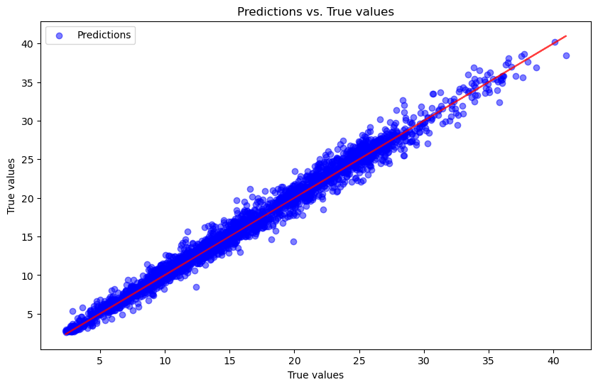

# Covid Cases Prediction Using Deep Learning

## Goal

The goal of this project is to solve a regression problem using deep neural networks. Basic DNN training techniques will be implemented (hyper parameter tuning, feature selection, regularization, etc.). The objective is to get more familiar with PyTorch and DNN architecture.

## Task Description

Given survey results in the past 3 days in a specific state in U.S., then predict the percentage of new tested positive cases in the 3rd day.

## Methodology

This notebook is divided into the following sections:

1. Data Exploration
2. Data Modeling
3. Empirical Results and Evaluation

### Data Exploration: 

We first take a closer look at our dataset to get a better understanding of what we are working with. In this section we see how this dataset is structured. Since it is a survey data, it includes the the answers of some questions, such as whether or not the surveyer was wearing a mask, using public transport, traveled out of state, etc., as well as the state of residence.

All columns have been one hot encoded (specifically for state), meaning we don't have to do a lot of preprocessing. As a safety measure, we will drop any rows with missing values and remove duplicate values. 

The first thing we notice is that the dataset only contains answers from 40 states. However, of the 40 states included in the survey, each of them is adequately represented so it should not affect our results too significantly.

We then look at a correlation matrix of the features (excluding states)

Heatmap interpretation:

1. Features seperated by day (day 0, day 1, day 2)
2. Strong correlation between day 0, day 1, day 2 features (i.e., wearing_mask, wearing_mask.1, wearing_mask.2). Makes sense in the context of the dataset since we are trying to predict positivite rate on 3rd day
3. Noticable correlation variance between features are target variable (test_positive)

These findings help us better understand the dataset. Moving onto data modeling using PyTorch.

### Data Modeling: Fully Connected Neural Network

Implementing a deep NN using Pytorch.

To start, we will implement a simple fully connected neural network to establish a baseline performance. Given the nature of the data, there is a chance that the data exhibits strong temporal or spatial dependency (i.e., survey answers from day 0 heavily influence the tested_positive.2). 

I have considered implementing an LSTM NN, which is designed for sequential data, but before moving forward with this it is important to start with a baseline model. After we evaluate the fully connected performance, we will decide whether or not to implement a more complex model.

To implement this model, we will to take the following steps:

1. Data Preparation
2. Define Model
3. Define loss function and optimizer
4. Train the model
5. Evaluate the model

**Data Preparation**

In order to train our model, the data must be converted to tensors. Pytorch has built in classes to conveniently handle datasets

*TensorDataset* stores the samples and their corresponding labels in singular dataset

*DataLoader* wraps an iterable around the Dataset to enable easy access to samples. Allows for batching and shuffling the training dataset.

*from PyTorch docs*

**Define Fully Connected Network**

Defining simple neural network with the following architecture:

- Input layer, taking features as input
- 3 hidden layers with decreasing neuron input/output (128, 64, 32)
- Output layer (tested_positve percentage on day 3)

Each layer will use the ReLu activation function when progressing through the network (defined in the forward method)

This network inherits nn.Module, PyTorch's built in module containing network methods.

**Define Loss Function and Optimizer**

Defining the model with input size as the # of features in our dataset.

Setting loss function as MSE since we are working on a regression task. Since we are dealing with a percentage, this value gives us a normalized metric to evaluate our results.

Using adam optimizer, common practice in deep learning tasks. This optimzer adjusts the learning rate of each parameter individually, often leading to faster convergence. We set the learning rate at .01.

**Train the Model**

We will train the model by implementing the following:

1. Training Loop: first iterates over the data for specified # of epochs. Inner loop iterates over the batches of data from dataloader, where each iteration processes one mini batch 

2. Zero Gradients: setting gradients back to zero for each iteration

3. Forward pass: inputs the data into the model, then computes the output. outputs.squeeze() is used to remove any extra dimensions from the output tensor

4. Calculate loss: loss function compared predicted - actual

5. Backward pass (backpropogation): the backward pass calculates the gradients of the loss with respect to the model's parameters

6. Optimization step: updates model parameters based on computed gradients

7. Monitor Progress: finally, an if statement is added to track the performance of the model -- printing the results after 10 epochs

**Model Evaluation**

Model:

FullyConnectedNN(
  (fc1): Linear(in_features=93, out_features=128, bias=True)
  (fc2): Linear(in_features=128, out_features=64, bias=True)
  (fc3): Linear(in_features=64, out_features=32, bias=True)
  (out): Linear(in_features=32, out_features=1, bias=True)
)

Mean Squared Error on the training set: 0.9874

Predictions vs. True values on training set:

Comparing predicted tested_positve.2 with tested_positive and tested_positive.1:

tested_positive	    tested_positive.1	tested_positive.2
22.055633	        21.029253	        20.783077
2.331589	        2.011478	        3.402343
1.658765	        2.163458	        3.498484
11.600093	        11.151200	        10.641472
2.458395	        2.525252	        3.140546
25.342487	        27.963939	        28.442484
27.283061	        26.082381	        26.466379
8.750022	        6.692929	        6.456845
11.784153	        10.946757	        11.663358
10.335195	        10.335195	        10.213203

## Empirical Results and Evaluation

***Notes on LSTM***

Since we are dealing with time series data, a common approach is to implement an LSTM neural network. This approach was considered because LSTMs are best for capturing nuanced temporal patterns that could be exhibited in this data. In our case, a simple RNN might suffice -- but LSTMs provide a more robust and flexible option. Since we are only dealing with 3 days worth of data, it seems that our fully connected network was still able to capture the overall trend of the data.

After training a fully connected network and getting some good results, we will save LSTM implementation for later. For the purposes of better our understanding of pytorch, our simple implementation is sufficient.

***Fully Connected Network Results:***

Our fully connected network seemed to perform relatively well, with an MSE of 0.9874 on the training data. In the context of our data, these results are fairly decent. The objective was to predict the percentage (out of 100) of testing positive on the third day. So, this means that on average, we are able to make prediction within ~1% above or below the actual result.

This can be seen in the plot that compares the predicted vs. actual data. We can see that our predicted values are fairly evenly distributed above and below the line representing the true values.

Furthermore, we tested our model on the test set. While we don't have the true results to evaluate the accuracy on testing data, we can compare our predicted values with the tested_positive.1 and tested_positive.2 values. As shown in the updated dataframe, we see that the predicted values are not too far off from the positively predicted cases in day 1 and day 2. This is a good indication that our model is properly capturing the nature of the data.

***Future Work***

While our model is effective for our objective of the project, there is certainly room for improvement in building a more precise and robust model. Some room for future work include:

1. Further Feature Selection: The model might benefit from updating the datasets such that only the most relevant features are selected for training. To do this, we can go back and select the features with the highest correlation with tested_positive.2.

2. Model Hyperparameter Tuning: Further hyperparameter tuning could have been done to improve the model. This could include testing different activation functions, # of epochs, batch size, etc. More time could be spent finding the optimal parameters for a more robust model.

3. Complex Model Implementation: This project might also benefit from the use of a more complex model to make predictions. For example, an LSTM model might have been able to better capture the temporal patterns exhibited in the dataset. This is work that can be added in the future.

***Conclusion***

This project helps better our understanding of building neural networks using pytorch. We were able to construct a fairly stable and robust fully connected network that can predict the liklihood of testing positive on day 3. 