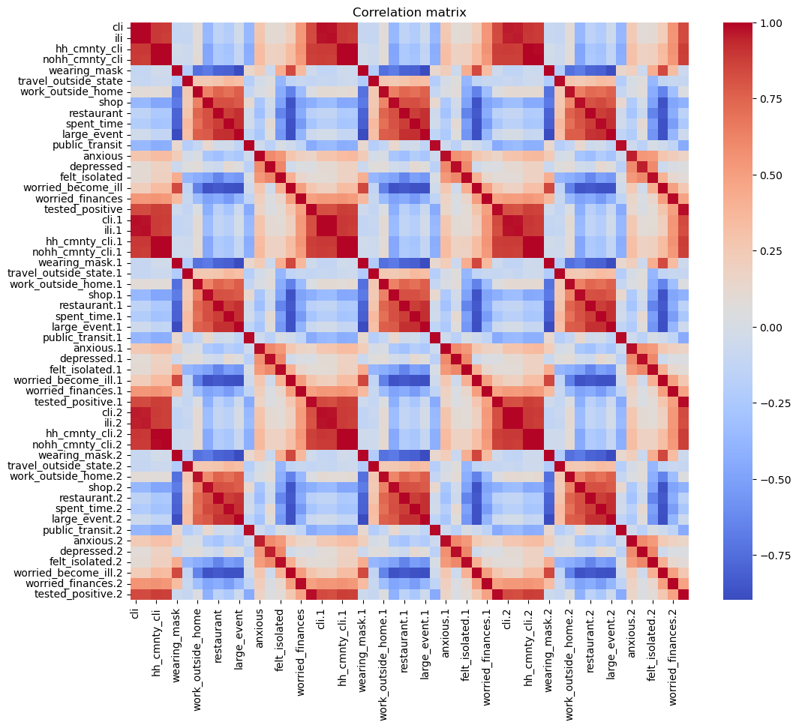

# Covid Cases Prediction Using Deep Learning

## Goal

The goal of this project is to solve a regression problem using deep neural networks. Basic DNN training techniques will be implemented (hyper parameter tuning, feature selection, regularization, etc.). The objective is to get more familiar with PyTorch and DNN architecture.

## Task Description

Given survey results in the past 3 days in a specific state in U.S., then predict the percentage of new tested positive cases in the 3rd day.

## Methodology

This notebook is divided into the following sections:

1. Data Exploration
2. Data Preparation
3. Data Modeling
4. Empirical Results and Evaluation

### Data Exploration: 

We first take a closer look at our dataset to get a better understanding of what we are working with. In this section we see how this dataset is structured. Since it is a survey data, it includes the the answers of some questions, such as whether or not the surveyer was wearing a mask, using public transport, traveled out of state, etc., as well as the state of residence.

All columns have been one hot encoded (specifically for state), meaning we don't have to do a lot of preprocessing. As a safety measure, we will drop any rows with missing values and remove duplicate values. 

The first thing we notice is that the dataset only contains answers from 40 states. However, of the 40 states included in the survey, each of them is adequately represented so it should not affect our results too significantly.

We then look at a correlation matrix of the features (excluding states)

Heatmap interpretation:

1. Features seperated by day (day 0, day 1, day 2)
2. Strong correlation between day 0, day 1, day 2 features (i.e., wearing_mask, wearing_mask.1, wearing_mask.2). Makes sense in the context of the dataset since we are trying to predict positivite rate on 3rd day
3. Noticable correlation variance between features are target variable (test_positive)

These findings help us better understand the dataset. Moving onto data preparation using PyTorch.

### Data Preparation

In order to train our model, the data must be converted to tensors. Pytorch has built in classes to conveniently handle datasets

**Dataset** stores the samples and their corresponding labels

We start by creating a custom dataset class for the Covid data, which includes the following methods:

__init__:       Initializes the dataset. 
                Takes features and labels as input as torch tensors

__len__:        Returns the length of the dataset

__getitem__:    Returns a sample from the dataset given an index

This is necessary to use DataLoader, which is crucial for training the model

**DataLoader** wraps an iterable around the Dataset to enable easy access to samples

The DataLoader class in PyTorch used to retreive the datasets features and labels on sample at a time. During model training, this allows us to pass samples in "minibatches", reshuffle the data each epoch to prevent overfitting, and use Python's multiprocessing for faster data retreival.

DataLoader is an iterable object that we can load our custom dataset into.

Key DataLoader parameters:

1. 'batch_size': defines # of samples returned in per each iteration
2. 'shuffle': data will be shuffled before being passed to the model if true.

*from PyTorch docs*

### Data Modeling

TODO:

## Empirical Results and Evaluation

**TODO:**

## Conclusion

**TODO:**